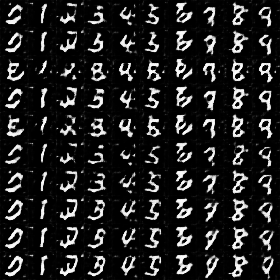
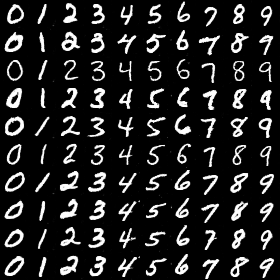
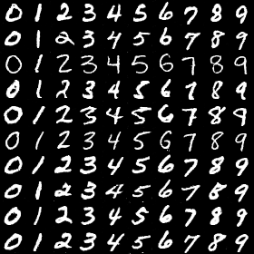
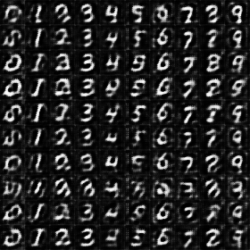
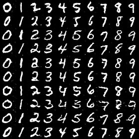
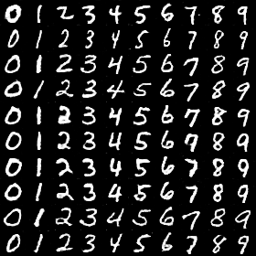
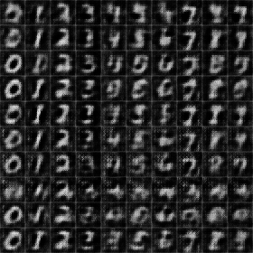

# Re-implement DFGAN with pytorch

## Acknowledgements
This repo is fork from [generative-model-collections](https://github.com/znxlwm/pytorch-generative-model-collections)  and reference [tensorflow-dfgan](https://github.com/sjenni/dfgan) Thanks for their sharing.

I implement _noise\_generator_ and  _moving average_ trick in code:
> CGAN_dfgan.py

and test this implement with **MNIST** dataset.

## How to use this repo
you can only use default configuration for training **MNIST** dataset with dfgan.

`python main.py`

The full code in :

`CGAN_dfgan.py`

If your have any problem , please tell me.

## Dataset

- MNIST
- Fashion-MNIST
- CIFAR10
- SVHN
- STL10
- LSUN-bed

#### Conditional generation
Each row has the same noise vector and each column has the same label condition.

*Name* | *Epoch 1* | *Epoch 25* | *Epoch 50* | *GIF*
:---: | :---: | :---: | :---: | :---: |
CGAN |  |  |  | 
DFGAN |  |  |  | 

## Development Environment
* Ubuntu 18.04 LTS
* NVIDIA GTX 2080 ti
* cuda 10.0
* Python 3.7
* pytorch 1.0
* torchvision 0.2.1

